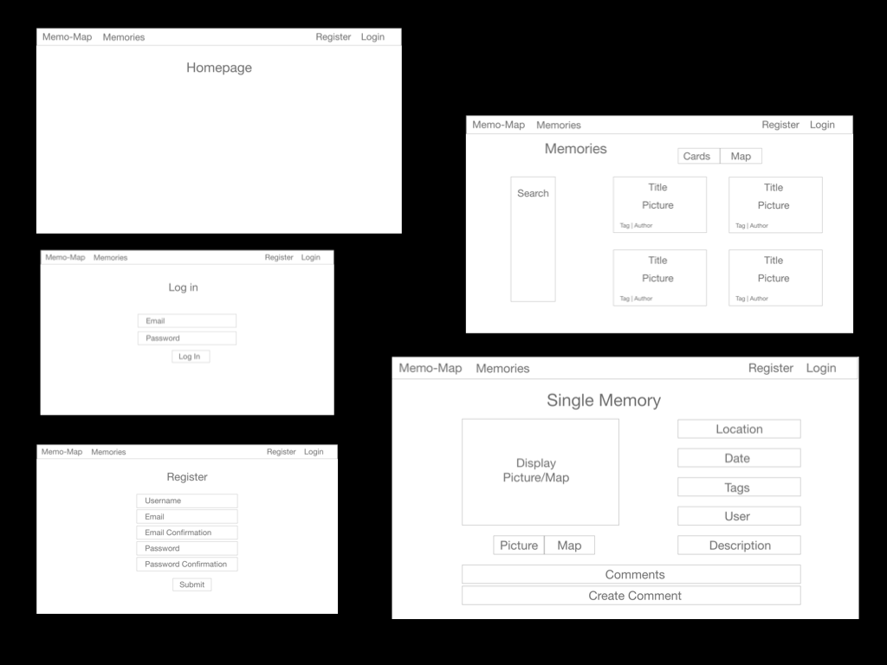
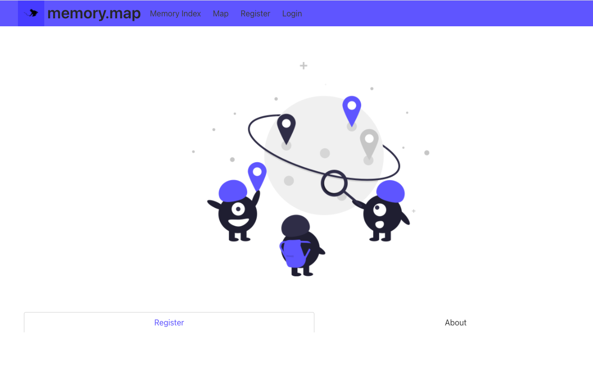
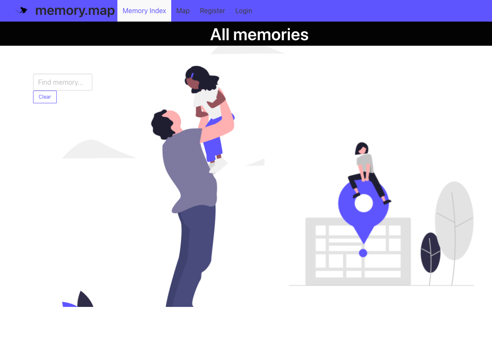

 GENERAL ASSEMBLY — SOFTWARE ENGINEERING IMMERSIVE 2021

# Memory Map
## Project 3

A platform to connect with places through other people's memories. Share and upload a memory and mark it on a map, and view other people's memories of a specific place. 

[Try it out.](https://memorymap.netlify.app/)

For the best user experience we would recommend to register and to create a new memory, to fully see all features that are available to a a registered, logged in owner of a memory.

## Authors
- [Anthony Graham](https://github.com/databoy5000)
- [Antoinette Demonceaux](https://github.com/Ant0inette)
- Kat Hackethal


## Table of Contents

1. [Brief](https://github.com/khackethal/project-3-client#brief)
2. [Approach](https://github.com/khackethal/project-3-client#brief)
   - [MVP](https://github.com/khackethal/project-3-client#mvp) 
   - [Technologies](https://github.com/khackethal/project-3-client#technologies)
   - [Methodologies](https://github.com/khackethal/project-3-client#methodologies)
3. [Planning](https://github.com/khackethal/project-3-client#planning)
   - [Back End](https://github.com/khackethal/project-3-client#back-end)
   - [Front End](https://github.com/khackethal/project-3-client#front-end)
4. [Project Frames](https://github.com/khackethal/project-3-client#project-frames)
5. [Wins & Challenges](https://github.com/khackethal/project-3-client#wins)
6. [Key Learnings & Future Features](https://github.com/khackethal/project-3-client#key-learnings)

## Brief

Create a working full-stack app that will be deployed online, with it's own Back End and Front End, using an Express API to serve your data from a Mongo database.
The app must be a complete product, meaning multiple relationships and CRUD functionality for your models. 
Implement thoughtful user stories and leave time to style the app.

## Approach

As we were working in a group, we had a clear joint excel google document with an overview of the project, detailing and assigning all tasks.
We would mark off tasks in the document as completed, and use it to ask questions or raise queries to the other group members.
This is in addition to being in a zoom breakout room together and therefore being able to ask quick questions right away, as well as helping each other with debugging through screen-sharing.

We had one common Git repository, which I was responsible for setting up alongside with the initial project structure to make the first commit, with two branches, "main" and "dev". <br/>
Further to this we each had two branches, one "own branch" and one "dev branch".<br/>
We would work in our "own branch" and before committing any changes, navigate to the "dev branch" and pull from the git main, then merge the updated "dev branch" with our own branch, resolving all conflicts, before finally pushing to the "dev branch" on git. I merged the "dev branch" into "main" at the very end of the project, at which time the other group members forked the repository. <br/>
This process helped to avoid any merging conflicts or unknowingly overwriting other people's code, and was a useful insight to how an actual dev team might work.


### MVP

We kept out MVP fairly simple with the option to add future features later on. <br/>
Our main requirements were:

- User authentication - Register & Login
- An Index Page for all Memories including a search function
- A page showing all memories on a map, including a search function
- A single memory view, with the option to edit and delete if the user has created the memory
- The ability to add tags to a memory
- A comment function, with the ability to delete the comment if the user has created the comment

### Technologies/ Frameworks/ APIs

#### Back End
- Axios
- Babel-ESlint
- Bcrypt
- Express
- Jest
- Supertest
- Json webtoken
- Mongo DB
- Mongoose
- Mongoose-Hidden
- Mongoose-Unique-Validator

- Back End deployment: Heroku

#### Front End
- Axios
- Cloudinary
- Bulma
- React
- React Router Dom
- Mapbox
- React Map GL
- React Map Gl Geocoder
- React Confirm Alert
- React Loader Spinner
- Moment
- Node.js

- Front End deployment: Netlify

### Methodologies
- Write readable, simple, DRY code per KISS
- Create reusable components that have a clear, specific task 


## Planning

We worked through initial models and wireframes as a group, before dividing up the first set of tasks. 
We did end up changing our models as our requirements changes once we had implemented all mapbox functionality, however the wireframes have largely stayed the same.

### Back End 

### Models

Below are the models we created for users and memories. Due to our extensive planning stage the only model we had to tweak slightly was the memory model, adding all location metrics in order to better integrate mapbox and mapbox search. I was responsible for amending the model and double checking all paths still work.

#### User Models

```js
import mongoose from 'mongoose'

import uniqueValidator from 'mongoose-unique-validator'
import mongooseHidden from 'mongoose-hidden'

import bcrypt from 'bcrypt'

const userSchema = new mongoose.Schema({
  username: { type: String, required: true, unique: true },
  email: { type: String, required: true, unique: true },
  password: { type: String, required: true },
})

// * password encryption
userSchema.pre('save', function encryptPassword(next) {
  if (this.isModified('password')) {
    this.password = bcrypt.hashSync(this.password, bcrypt.genSaltSync())
  }
  next()
})

userSchema.methods.validatePassword = function validatePassword(password) {
  return bcrypt.compareSync(password, this.password)
}

// * password confirmation 
userSchema
  .virtual('passwordConfirmation')
  .set(function setPasswordConfimation(passwordConfirmation) {
    this._passwordConfirmation = passwordConfirmation
  })

userSchema
  .pre('validate', function checkPassword(next) {
    if (this.isModified('password') && (this.password !== this._passwordConfirmation)) {
      this.invalidate('passwordConfirmation', 'should match password')
    }
    next()
  })

userSchema.plugin(mongooseHidden({ defaultHidden: { password: true, email: true, _id: true } }))
userSchema.plugin(uniqueValidator)

export default mongoose.model('User', userSchema)
```

#### Memory Models

```js
import mongoose from 'mongoose'
import uniqueValidator from 'mongoose-unique-validator'

// * Embedded comment schema
const commentSchema = new mongoose.Schema( {
  text: { type: String, required: true },
  user: {
    userId: { type: mongoose.Schema.ObjectId, ref: 'User', required: true },
    username: { type: String, ref: 'User', required: true },
  },
} , { timestamp: true } 
)

//* memory schema 
const memorySchema = new mongoose.Schema({
  title: { type: String, required: true, unique: true },
  date: { type: Date, required: true },
  image: { type: String },
  description: { type: String, required: true, unique: true },
  tags: [{ type: String }],
  location: {
    userInput: { type: String, required: true },
    coordinates: {
      type: [Number],
      required: true,
      validate: [{
        validator: (coordinates) => coordinates.length === 2,
        message: (coordinates) => `Requirement array.length === 2. Current length is ${coordinates.length}`,
      }],
    },
    boundaryBox: { type: [Number] },
    placeType: { type: String },
  },
  user: {
    userId: { type: mongoose.Schema.ObjectId, ref: 'User', required: true },
    username: { type: String, ref: 'User', required: true },
  },
  comments: [commentSchema],
})


memorySchema.plugin(uniqueValidator)

export default mongoose.model('Memory', memorySchema)
```

### Front End

Below are the original wireframes we planned out as a group.



I wrote the All Memories pages (both index and map), New Memory page, edit Memory page and Single Memory page, while the other group members focused on user authentication and secure route, implementing image uploads and styling the app.
The most noteworthy page is the Single Memory page, as it unites the most logic, with deleting the memory and adding and deleting comments all implemented on the page.

 
```js
import axios from 'axios'
import React from 'react'
import { useHistory, useParams } from 'react-router-dom'
import ReactMapGl, { Marker } from 'react-map-gl'
import moment from 'moment'

import Error from '../common/Error'
import { memoriesPath, commentPath, headers, deleteMemory, editPath } from '../../lib/api'
import { baseUrl } from '../../config'
import { isOwner } from '../../lib/auth'
import { publicToken, mapboxStyleUrl } from '../../lib/mapbox'
import { subSetViewport } from '../../lib/mapbox'

import { confirmAlert } from 'react-confirm-alert'
import 'react-confirm-alert/src/react-confirm-alert.css'

function SingleMemory() {

  const { memoryId } = useParams()
  const history = useHistory()

  const [memory, setMemory] = React.useState(null)
  const [isError, setIsError] = React.useState(false)
  const [hasComments, setHasComments] = React.useState(false)

  const isLoading = !memory && !isError

  //* for comments/error state
  const [formComment, setFormComment] = React.useState({
    text: '',
  })
  const [formError, setFormError] = React.useState(formComment)

  //* For map content-------------------
  const [viewport, setViewport] = React.useState({
    latitude: 51.51106,
    longitude: -0.13519,
    width: '500px',
    height: '500px',
    zoom: 14,
  })

  //* For page content render
  React.useEffect(() => {

    const getData = async () => {

      try {

        const res = await axios.get(`${baseUrl}${memoriesPath}/${memoryId}`)
        setMemory(res.data)

        // * setting zoom value depending on stored values
        const [[centerLongitude, centerLatitude], zoomValue] = subSetViewport(res.data)

        setViewport({
          ...viewport,
          longitude: centerLongitude,
          latitude: centerLatitude,
          zoom: zoomValue,
        })

      } catch (err) {
        setIsError(true)
      }
    }

    getData()

    // eslint-disable-next-line react-hooks/exhaustive-deps
  }, [hasComments])


  const handleChange = (e) => {
    setFormComment({ ...formComment,
      [e.target.name]: e.target.value,
    })
  }

  const handleSubmit = async (e) => {

    e.preventDefault()

    // * to prevent empty comments submissions
    if (formComment.text) {
      try {

        await axios.post(
          `${baseUrl}${memoriesPath}/${memoryId}/${commentPath}`,
          formComment,
          headers()
        )

        // * reset comment input
        e.target.value = ''

        // * force useEffect render on comment submission
        setHasComments(!hasComments)

        // * reset comment forms to blank
        setFormComment({ ...formComment, text: '' })
        setFormError('')

      } catch (err) {
        setFormError({ ...formError, text: err.response.data.errMessage })
      }

    } else {
      return
    }
  }

  //* Delete a comment 
  const handleDelete = async (e) => {
    e.preventDefault()
    try {

      await axios.delete(
        `${baseUrl}${memoriesPath}/${memoryId}/${commentPath}/${e.target.name}`,
        headers()
      )
      setHasComments(!hasComments)
      setFormError({ ...formComment, text: '' })

    } catch (err) {
      setFormError({ ...formError, text: err.response.data.errMessage })
    }
  }

  //* Delete a memory
  const submitDelete = () => {
    confirmAlert({
      title: 'Are you sure you would like to delete this memory? ',
      message: 'Click yes to confirm the delete request.',
      buttons: [
        {
          label: 'Yes',
          onClick: async() => {

            await deleteMemory(memory._id)
            history.push(memoriesPath)
            
          },
        },
        {
          label: 'No',
          onClick: () =>  { 
            return 
          },
        }
      ],
    })
  }

  //* Edit a memory
  const handleMemoryEdit = async() => {
    history.push(`${memoriesPath}/${memory._id}${editPath}`)
  }

  return (
    <section>
      
      { isError && <Error />}
      { isLoading && <p> ... loading</p>}

      { memory && (
        <>
          <div className="container">
            <div className="card has-background-black has-text-white is-centered">
              
              <div className="title has-text-white is-3">
                {memory.title}
                <span className="subtitle is-7 has-text-warning">
                  member - {memory.user.username}
                </span>
                <p>{moment(memory.date).format('MMMM Do, YYYY')}</p>
              </div>

              <div className="columns">
                <div className="column">

                  <div className="title is-5 has-text-success">
                    {memory.location.userInput}
                  </div>

                  <div className="column is-half is-offset-half">

                    <figure className="image">
                      
                    </figure>

                  </div><div className="column is-6 description">
                    {memory.description}
                  </div>

                  <div className="columns is-mobile">

                  </div>


                  <div className="column is-offset-one-third">
                    <div className="bd-notification is-info">

                      <ReactMapGl {...viewport}
                        mapboxApiAccessToken={publicToken}
                        mapStyle={mapboxStyleUrl}
                        onViewportChange={viewport => {
                          setViewport(viewport)
                        }}
                      >

                        <Marker
                          latitude={memory.location.coordinates[1]}
                          longitude={memory.location.coordinates[0]}
                        >
                          <div>
                            
                          </div>
                        </Marker>

                      </ReactMapGl>
                      <br></br>
                      {isOwner(memory.user.userId) &&
                      <button 
                        className="button is-warning"
                        onClick={handleMemoryEdit}
                      >Edit Memory</button>
                      }
                      {isOwner(memory.user.userId) && 
                        <button className="button is-danger" onClick={submitDelete}>Delete Memory</button>
                      }
                    </div>
                  </div>
                </div>

              </div>
            </div>
            <div className="container">
              <div className="columns">

                <form
                  className="column is-half is-offset-one-quarter box"
                  onSubmit={handleSubmit}
                  onKeyUp={(
                    (e) => {
                      if (e.key === 'Enter') handleSubmit
                    }
                  )}
                >

                  <div className="field" htmlFor="text">
                    <label className="label">Comments</label>
                    <div className="control">

                      <input
                        className={`input ${formError.text ? 'is-danger' : ''} `}
                        placeholder="Type your comments here.."
                        name="text"
                        value={formComment.text || ''}
                        onChange={handleChange}
                      />

                    </div>
                    {formError.text
                      &&
                      <p className="help is-danger">
                        Oops, something went wrong. Check if you are logged in.
                      </p>
                    }
                  </div>

                  <div className="field">
                    <button
                      type="submit"
                      className="button is-info is-fullwidth"
                    >
                      Submit comment
                    </button>
                  </div>

                </form>
              </div>

              <div className="section">
                <div className="comments">
                  {memory.comments && memory.comments.map(comment => {

                    return (
                      <div key={comment._id}>

                        <h6>{comment.user.username}</h6>
                        <p>{comment.text}</p>

                        {isOwner(comment.user.userId) &&
                          <button
                            name={comment._id}
                            onClick={handleDelete}
                            className="button is-info is-small is-outline"
                          >
                            Delete comment
                          </button>
                        }

                      </div>
                    )
                  }
                  )}
                </div>
              </div>
            </div>
          </div>
        </>)}
    </section>
  )
}

export default SingleMemory
```

## Project Frames

### Homepage



### Memory Index



## Wins, Challenges & Bugs

### Wins

The project was a great way to iterate over basic React patterns and become really familiar with them, I found myself being able to create assigned pages fast and without having to consult any third parties.
After reading through the documentation I also found it very easy to work with mapbox. 


### Challenges & Bugs

The main challenge was figuring out how to correctly work with Github between all group members, but thankfully we overcame it quite early on.
I made a detailed 7 step checklist for everyone to follow once I had understood the process myself, and we didn't have any further problems.
Then as always more time would have been great, we scrambled a little to get all small bugs fixed by the end of the assigned project time.

One small bug remains with mapbox, namely the style I've used has actually been officially taken out of the mapbox style library- I found it and was able to add it via a blogpost of the creator.
Therefore a warning console log appears about versions.

### Key Learnings & Future Features

The most valuable lesson from this project was working as a larger group, and the importance of correctly integrating your own code into a larger codebase. 
We achieved all initially planned features, but given more time I would have liked to add an "Inspire Me" page and function that displays a random memory every time.


